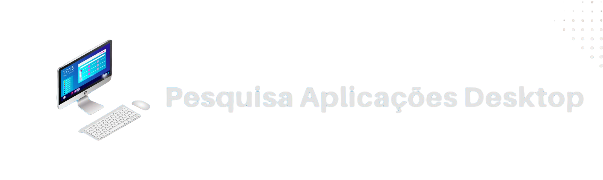

<hr>

<h3 align="center">
    
    <br><br>
    <p align="center">
      <a href="#-sobre">Sobre</a>&nbsp;&nbsp;&nbsp;|&nbsp;&nbsp;&nbsp;
      <a href="#-alunos-integrantes-da-equipe">Alunos Integrantes da Equipe</a>&nbsp;&nbsp;&nbsp;|&nbsp;&nbsp;&nbsp;
      <a href="#-professores-responsáveis">Professores responsáveis</a>&nbsp;&nbsp;&nbsp;|&nbsp;&nbsp;&nbsp;
      <a href="#-tecnologias">Tecnologias</a>&nbsp;&nbsp;&nbsp;|&nbsp;&nbsp;&nbsp;
      <a href="#-instruções-de-utilização">Instruções de utilização</a>&nbsp;&nbsp;&nbsp;|&nbsp;&nbsp;&nbsp;
      <a href="#-licença">Licença</a>
  </p>
</h3>

<hr>

## 🔖 Sobre

#### Hipótese     
Ao longo dos anos, os navegadores evoluíram e passaram a ter mais funcionalidades e suportar aplicações mais elaboradas. Nesse contexto, a evolução da internet e a praticidade de acessar os sistemas via web diminuiu a necessidade de se ter uma aplicação desktop. Contudo, alguns segmentos de aplicações necessitam de ser desktop, como antivírus.     
Nesse sentido, foi pensado que <strong>ainda existem segmentos populares no contexto de aplicações desktop</strong>.

#### Objetivo principal     
O objetivo principal do projeto é testar a hipótese inicial e registrar o resultado. Dessa forma, por meio de pesquisa e análise de dados, <strong>busca-se descobrir segmentos que ainda são populares para aplicações desktop</strong>. 

#### GQM (Goal, Question, Metric)      
Análise de repositórios de aplicações desktop       
com o objetivo de analisar viabilidade de desenvolvimento destas aplicações atualmente      
com relação a quantidade de aplicações e seus segmentos     
do ponto de vista de analistas, gerentes e clientes de novos projetos     
no contexto dos repositórios do Github que possuem dependências de aplicações desktop das linguagens Java, C# e JavaScript.     

#### Questões e métricas      
- Pegunta 1: <strong>A quantidade de aplicações desktop vem diminuindo ao longo da última década?</strong>       
  - Métrica 1: Proporção de repositórios que utilizam tags que são semelhantes versus que não utilizam tags;        
  - Métrica 2: Percentual da quantidade de repositórios desktop para cada segmento.       
- Pegunta 1: <strong>Para as aplicações desktop que ainda são mantidas, qual o propósito que eles se encontram atualmente?</strong>       
  - Métrica 1: Média de repositórios com dependências de aplicações desktop criados por ano para cada segmento;        
  - Métrica 2: Proporção de repositórios com dependências de aplicações desktop versus sem dependências de aplicações desktop.       
- Pegunta 1: <strong>Quais linguagens de programação são mais utilizadas em aplicações desktop??</strong>       
  - Métrica 1: Percentual de uso de cada uma das linguagens de programação em repositórios desktop;        
  - Métrica 2: Percentual de uso de cada uma das linguagens de programação em repositórios desktop para cada segmento.       

---

## 👨‍💻 Alunos integrantes da equipe

* [Guilherme Gabriel Silva Pereira](https://github.com/guizombas)
* [Henrique Penna Forte Monteiro](https://github.com/Henrikkee)
* [Lucas Ângelo Oliveira Martins Rocha](https://lucasangelo.com)
* [Victor Boaventura Goes Campos](https://github.com/777-victor)
* [Vinícius Marini Costa E Oliveira](https://github.com/marinisz)

---

## 👩‍🏫 Professores responsáveis

* Felipe Augusto Lima Reis
* José Laerte Pires Xavier Junior

---

## 🚀 Tecnologias

- [Python](https://www.python.org/)
- [Github GraphQL Explorer](https://docs.github.com/en/graphql/overview/explorer/)
- [MySQL Server](https://dev.mysql.com/downloads/installer/)

---

## ⤵ Instruções de utilização

Essas instruções vão te levar a uma cópia do projeto rodando em sua máquina local para propósitos de testes e desenvolvimento.

### Passo a passo de: como instalar e iniciar o script da aplicação localmente:

Pré-requisitos:
- Ter instalado [Python em uma versão compatível com a >=3.10.4](https://www.python.org/downloads/release/python-3104/)
- [MySQL Server instalado e inicializado](https://dev.mysql.com/downloads/installer/)

<br>

- Passo 1: Clonar o repositório:
  ```bash
  $ git clone https://github.com/ICEI-PUC-Minas-PPLES-TI/plf-es-2022-2-ti6-3150100-pesquisaaplicacoesdesktop.git
  ```

<br>

- Passo 2: Atualizar credenciais do MySQL e Github Token

  - Passo 2.1: Entrar na pasta dos scripts:
  ```bash
  $ cd plf-es-2022-2-ti6-3150100-pesquisaaplicacoesdesktop/Codigo/
  ```

  - Passo 2.2: Abrir o arquivo [getdependedables.py](plf-es-2022-2-ti6-3150100-pesquisaaplicacoesdesktop/Codigo/getdependedables.py) e configurar com seu acesso ao MySQL Server:
  ```bash
  $ vim getdependedables.py
  ```

  - Passo 2.3: Abrir o arquivo [gettopics.py](plf-es-2022-2-ti6-3150100-pesquisaaplicacoesdesktop/Codigo/gettopics.py) e configurar com seu acesso ao MySQL Server:
  ```bash
  $ vim gettopics.py
  ```

  - Passo 2.4: Abrir o arquivo [gettopics.py](plf-es-2022-2-ti6-3150100-pesquisaaplicacoesdesktop/Codigo/gettopics.py) e adicionar seu Github Personal Token:
  ```bash
  $ vim gettopics.py
  ```

<br>

- Passo 3: Iniciar os scripts

  - Passo 3.1: Iniciar o script [getdependedables.py](plf-es-2022-2-ti6-3150100-pesquisaaplicacoesdesktop/Codigo/getdependedables.py):
  ```bash
  $ plf-es-2022-2-ti6-3150100-pesquisaaplicacoesdesktop/Codigo/
  $ python getdependedables.py
  ```

  - Passo 3.2: Iniciar o script [gettopics.py](plf-es-2022-2-ti6-3150100-pesquisaaplicacoesdesktop/Codigo/gettopics.py):
  ```bash
  $ plf-es-2022-2-ti6-3150100-pesquisaaplicacoesdesktop/Codigo/
  $ python gettopics.py
  ```

---

## 🔗 Links do projeto

- [Artefatos](Artefatos)
- [Codigo](Codigo)
- [Divulgacao](Divulgacao)
- [Documentacao](Documentacao)

---

## 📝 Licença

Esse projeto está sob a licença Creative Commons Attribution 4.0 International. Veja o arquivo [LICENSE](LICENSE) para mais detalhes.

---
