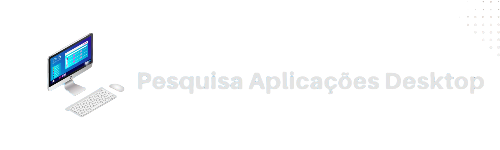
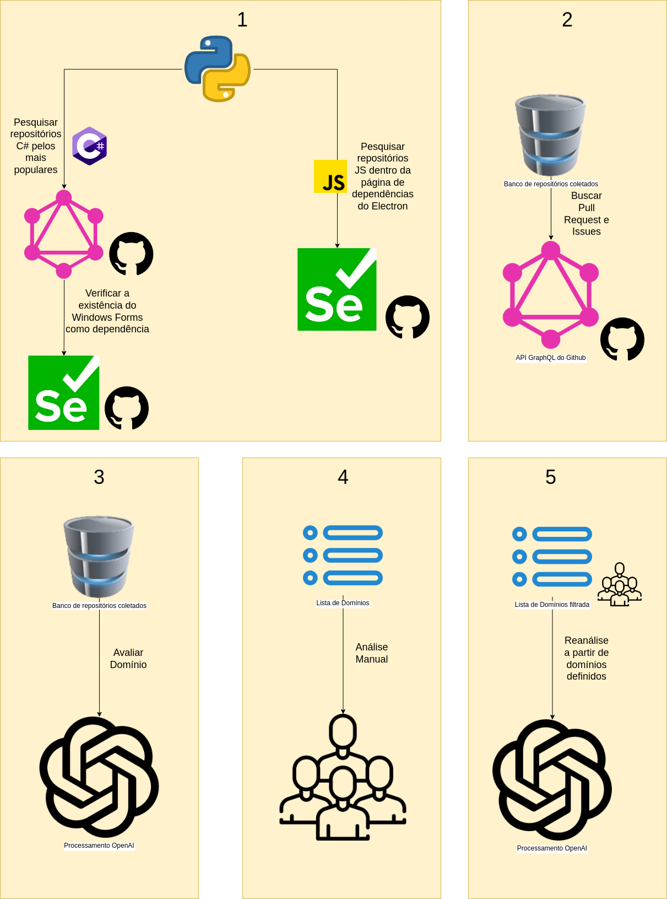

<hr>

<h3 align="center">
    
    <br><br>
    <p align="center">
      <a href="#-sobre">Sobre</a>&nbsp;&nbsp;&nbsp;|&nbsp;&nbsp;&nbsp;
      <a href="#-metodologia">Metodologia</a>&nbsp;&nbsp;&nbsp;|&nbsp;&nbsp;&nbsp;
      <a href="#-alunos-integrantes-da-equipe">Alunos Integrantes da Equipe</a>&nbsp;&nbsp;&nbsp;|&nbsp;&nbsp;&nbsp;
      <a href="#-professores-responsáveis">Professores responsáveis</a>&nbsp;&nbsp;&nbsp;|&nbsp;&nbsp;&nbsp;
      <a href="#-tecnologias">Tecnologias</a>&nbsp;&nbsp;&nbsp;|&nbsp;&nbsp;&nbsp;
      <a href="#-instruções-de-utilização">Instruções de utilização</a>&nbsp;&nbsp;&nbsp;|&nbsp;&nbsp;&nbsp;
      <a href="#-licença">Licença</a>
  </p>
</h3>

<hr>

## 🔖 Sobre

#### Hipótese     
Ao longo dos anos, os navegadores evoluíram e passaram a ter mais funcionalidades e suportar aplicações mais elaboradas. Nesse contexto, a evolução da internet e a praticidade de acessar os sistemas via web diminuiu a necessidade de se ter uma aplicação desktop. Contudo, alguns segmentos de aplicações necessitam de ser desktop, como antivírus.     
Nesse sentido, foi pensado que <strong>ainda existem segmentos populares no contexto de aplicações desktop</strong>.

#### GQM (Goal, Question, Metric)      
Análise de repositórios de aplicações desktop 
com o objetivo de caracterizar aplicações desktop e seus domínios
com relação a quantidade de aplicações e suas respectivas métricas
do ponto de vista de analistas, gerentes e clientes de novos projetos
no contexto dos repositórios do Github que possuem dependências de aplicações desktop das linguagens C# e JavaScript.

- QP.1: <strong>Para as aplicações desktop que ainda são mantidas, qual o domínio que elas se encontram atualmente?</strong>       
  - M.1: Proporção de repositórios que possuem descrições e domínios contra que não possuem descrições ou domínios;        
  - M.2: Percentual da quantidade de repositórios desktops para cada domínio.       
- QP.2: <strong>A quantidade de aplicações desktop vem diminuindo ao longo da última década?</strong>       
  - M.3: Média de repositórios de aplicações desktops criados por ano para cada domínio;        
  - M.4: Média de repositórios de aplicações desktops criados por ano.       
- QP.3: <strong>Aplicações desktop tem engajamento da comunidade?</strong>       
  - M.5: Percentual de pull requests merged em relação aos não merged dos repositórios desktop por ano;        
  - M.6: Percentual de issues fechadas em relação a não fechadas em repositórios de aplicações desktops por ano.       

---

#### Metodologia

<div align="center">
    
</div>


## 👨‍💻 Alunos integrantes da equipe

* [Guilherme Gabriel Silva Pereira](https://github.com/guizombas)
* [Henrique Penna Forte Monteiro](https://github.com/Henrikkee)
* [Lucas Ângelo Oliveira Martins Rocha](https://lucasangelo.com)
* [Victor Boaventura Goes Campos](https://github.com/777-victor)
* [Vinícius Marini Costa E Oliveira](https://github.com/marinisz)

---

## 👩‍🏫 Professores responsáveis

* Felipe Augusto Lima Reis
* José Laerte Pires Xavier Junior

---

## 🚀 Tecnologias

- [Python](https://www.python.org/)
- [Selenium](https://www.selenium.dev/)
- [Github GraphQL Explorer](https://docs.github.com/en/graphql/overview/explorer/)
- [MySQL Server](https://dev.mysql.com/downloads/installer/)

---

## ⤵ Instruções de utilização

Essas instruções vão te levar a uma cópia do projeto rodando em sua máquina local para propósitos de testes e desenvolvimento.

### Passo a passo de: como instalar e iniciar o script da aplicação localmente:

- Pré-requisitos instalados:
    - [Python em uma versão compatível com a >=3.10.4](https://www.python.org/downloads/release/python-3104/)
    - [MySQL Server instalado e inicializado](https://dev.mysql.com/downloads/installer/)
    - [Selenium](https://www.selenium.dev/downloads/)

<br>

- Passo 1: Clonar o repositório:
  ```bash
  $ git clone https://github.com/ICEI-PUC-Minas-PPLES-TI/plf-es-2022-2-ti6-3150100-pesquisaaplicacoesdesktop.git
  ```

<br>

- Passo 2: Atualizar credenciais do MySQL e Github Token

  - Passo 2.1: Entrar na pasta dos scripts:
  ```bash
  $ cd plf-es-2022-2-ti6-3150100-pesquisaaplicacoesdesktop/Codigo/
  ```

  - Passo 2.2: Copiar o arquivo [.env.sample](plf-es-2022-2-ti6-3150100-pesquisaaplicacoesdesktop/Codigo/.env.sample) para .env e configurar com seu acesso ao MySQL Server e tokens da [OpenAI](https://beta.openai.com/) e [GitHub Personal Token](https://github.com/settings/tokens):
  ```bash
  $ mv .env.sample .env
  $ vim .env
  ```

<br>

- Passo 3: Iniciar os scripts

  - Passo 3.1: Iniciar o script [getRepositories.py](plf-es-2022-2-ti6-3150100-pesquisaaplicacoesdesktop/Codigo/javascript/getRepositories.py) para capturar repositórios Electron (JavaScript):
  ```bash
  $ plf-es-2022-2-ti6-3150100-pesquisaaplicacoesdesktop/Codigo/javascript
  $ python getRepositories.py
  ```

  - Passo 3.2: Iniciar o script [getRepositories.py](plf-es-2022-2-ti6-3150100-pesquisaaplicacoesdesktop/Codigo/csharp/getRepositories.py) para capturar repositórios Windows Forms (C#):
  ```bash
  $ plf-es-2022-2-ti6-3150100-pesquisaaplicacoesdesktop/Codigo/csharp
  $ python getRepositories.py
  ```

  - Passo 3.3: Iniciar o script [fillIssuesAndPullRequests.py](plf-es-2022-2-ti6-3150100-pesquisaaplicacoesdesktop/Codigo/fillIssuesAndPullRequests.py) para preencher os dados de issues e pull requests de todos os repositórios de JavaScript e C# encontrados:
  ```bash
  $ plf-es-2022-2-ti6-3150100-pesquisaaplicacoesdesktop/Codigo/
  $ python fillIssuesAndPullRequests.py
  ```

  - Passo 3.4: Iniciar o script [fillTopicsAndDescriptions.py](plf-es-2022-2-ti6-3150100-pesquisaaplicacoesdesktop/Codigo/fillTopicsAndDescriptions.py) para preencher os dados de topics e descriptions de todos os repositórios de JavaScript e C# encontrados:
  ```bash
  $ plf-es-2022-2-ti6-3150100-pesquisaaplicacoesdesktop/Codigo/
  $ python fillTopicsAndDescriptions.py
  ```

  - Passo 3.5: Iniciar o script [openAIClassify.py](plf-es-2022-2-ti6-3150100-pesquisaaplicacoesdesktop/Codigo/openAIClassify.py) para fazer a primeira classificação de domínios com a inteligência artificial da GPT-3 OpenAI dos repositórios de JavaScript e C# encontrados:
  ```bash
  $ plf-es-2022-2-ti6-3150100-pesquisaaplicacoesdesktop/Codigo/
  $ python openAIClassify.py
  ```

  - Passo 3.6: Iniciar o script [openAIReClassify.py](plf-es-2022-2-ti6-3150100-pesquisaaplicacoesdesktop/Codigo/openAIReClassify.py) para fazer a segunda classificação de domínios com base em uma lista de domínios pré-existente e analisada manualmente (adicionada hardcode) com a inteligência artificial da GPT-3 OpenAI dos repositórios de JavaScript e C# encontrados:
  ```bash
  $ plf-es-2022-2-ti6-3150100-pesquisaaplicacoesdesktop/Codigo/
  $ python openAIReClassify.py
  ```

---

## 🔗 Links do projeto

- [Artefatos](Artefatos)
- [Codigo](Codigo)
- [Divulgacao](Divulgacao)
- [Documentacao](Documentacao)
- [Artigo Overleaf](https://www.overleaf.com/read/dbbndtfmtwtg)
- [DataStudio Dashboard](https://datastudio.google.com/s/gbUxKJFy2U0)

---

## 📝 Licença

Esse projeto está sob a licença Creative Commons Attribution 4.0 International. Veja o arquivo [LICENSE](LICENSE) para mais detalhes.

---
